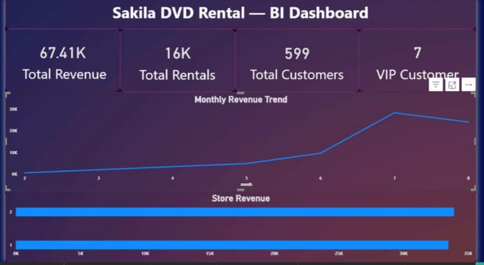
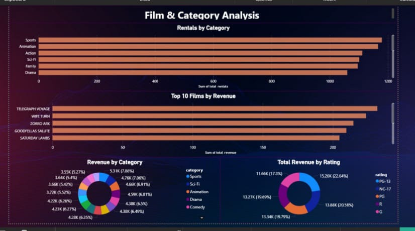
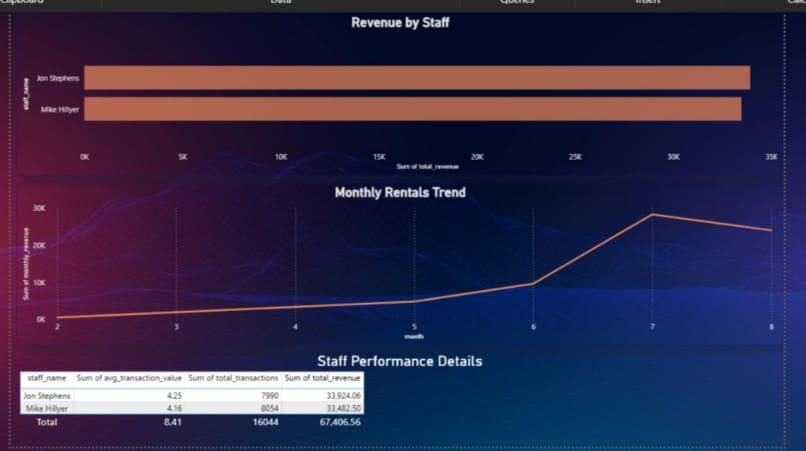
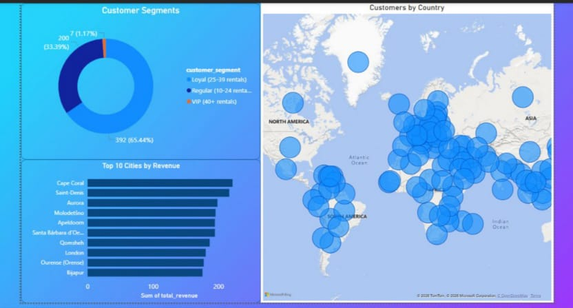
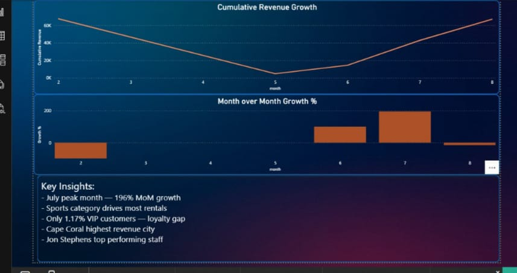

# Sakila DVD Rental — SQL Business Intelligence Project

## Overview
End-to-end SQL analytics project analyzing a DVD rental 
business using MySQL and Power BI.

## Key Findings
- Total Revenue: $67,406.56 across 16,044 rentals
- July was peak month with 196% MoM revenue growth
- Sports is the most rented category
- PG-13 films generate highest revenue (22.64%)
- Only 1.17% VIP customers — loyalty program opportunity
- Cape Coral is highest revenue city
- Jon Stephens is top performing staff member

## Tools Used
MySQL | Power BI | Excel

## Skills Demonstrated
- Complex SQL queries (CTEs, Window Functions, Subqueries)
- Multi-table JOINs (5+ tables)
- Business Intelligence Dashboard Design
- Data Storytelling & Business Recommendations

## Dashboard Pages
1. Executive Summary
2. Film & Category Analysis
3. Customer Insights
4. Store & Staff Performance
5. Growth Trends

## Dashboard Screenshots

### Executive Summary

### Film Analysis

### Customer Insights

### Store & Staff Performance

### Growth Trends

   
